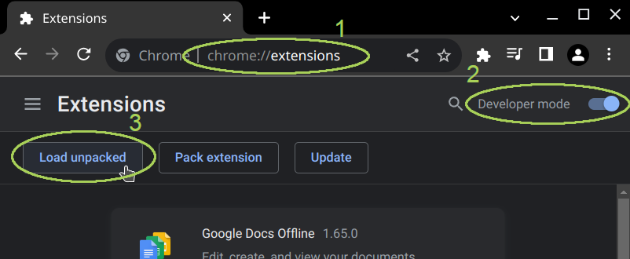
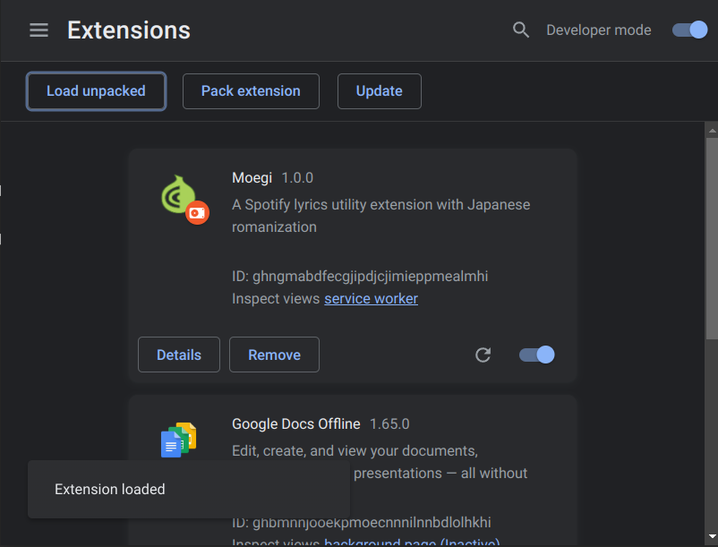

<div align="center">
  <h1>Moegi</h1>
  <video src="https://github.com/sglkc/moegi/assets/31957516/811b1143-d51f-4084-84ff-39da63b99c47" width="360" autoplay="false" ></video>

  <br />

  [](LICENSE)
  [](https://github.com/sglkc/moegi/issues)
  [](https://github.com/sglkc/moegi/pulls)
  [](https://github.com/sglkc/moegi/releases/latest)

  <strong>An extension for Chromium browsers to customize lyrics in Spotify Web Player.</strong>

  <a href="https://github.com/sglkc/moegi/issues">Report a Bug</a>
  <strong>·</strong>
  <a href="https://github.com/sglkc/moegi/issues">Request a Feature</a>

  Features lyrics translation for over 100 languages powered by Google Translate and \
  romanization for Chinese, Korean, Japanese, Cyrillic, and many more non-latin scripts! \
  *Tested on Google Chrome (135.0.7049.52) and Brave Browser (137.1.79.119) on Linux*

  <br />
</div>

## Version 2 Todo

- Rework to WXT 💚
- Auto-release on new tags (ci/cd)
- Reset defaults button
- DeepL translation
- Reimplement fullscreen handling
- Implement active lyric listener
- Picture-in-picture lyrics
- Update README, video, and screenshots

## Getting Started

Chromium browsers doesn't support installing extensions directly outside of Chrome Web Store, so follow these steps carefully:

1. Download the **latest release (moegi-x.x.x.zip)** archive from https://github.com/sglkc/moegi/releases/latest
2. **Extract and remember the location** of the extracted folder (moegi-x.x.x)
3. Open Chrome extensions page at ***chrome://extensions***
4. Toggle **developer mode** at the topmost bar
5. Click on the new **Load unpacked** button
6. Find and **select the folder** you extracted earlier (moegi-x.x.x)
7. Moegi should be added to the list and switched on, pin the extension for easy access
   - Click on the puzzle piece icon on the top-right
   - Find Moegi and click on the pin icon
8. Open Spotify Web Player (https://open.spotify.com)
9. Play any song and open the lyrics page by clicking the microphone icon on bottom-right
10. If you click on Moegi, it should now display a popup, nice!

<details>
  <summary>Steps screenshot</summary>
  
  
</details>

## Features

<details>
  <summary>Show full extension features screenshot</summary>
  
</details>

### Lyrics Styling

The most basic feature to customize your Spotify lyrics screen:

- **Text Align**: Where the lyrics should align. *Default: Left, Options: Left, Center, Right.*
- **Font Size**: Set the lyrics relative font size including translation and romanization if active. *Default: 1em, Options: 0.5-2.5em.*
- **Spacing**: How much space between lyric lines. *Default: 0px, Options: 0-64px.*
- **Colors**: Set background and lyrics colors using a color picker. \
  *Default: Background (blueish), Active (white), Inactive (black), Passed (white with opacity)*

> There is an integration issue with the colors, so if you want to reset the colors, use the Reset to defaults button

### Translation

Library used: [google-translate-api-x](https://github.com/AidanWelch/google-translate-api)

Translate lyrics line-by-line using Google Translate, successful translations are cached temporarily in storage to avoid Google Translate limit.
Note that translations are not accurate and should not be used literally! [Read about privacy policy.](#privacy-policy)

- **Font Size**: Set the translation line relative to lyrics font size. *Default: 1em, Options: 0.5-1.5em.*
- **Language Target**: Translation language target. *Default: auto, Options: [Over 100 languages](https://cloud.google.com/translate/docs/languages).*

### Romanization

Mainly supported languages:
1. [Japanese](#japanese)
2. [Korean](#korean)
3. [Chinese](#chinese)
4. [Cyrillic](#cyrillic)

Other than that, use [Anything else](#any).

Romanize lyrics that has the selected language's characters, if none then it will skip to the next line.

- **Language**: Language to romanize. *Default: Korean, Options: Korean, Japanese.*
- **Font Size**: Set the romanization line relative to lyrics font size. *Default: 1em, Options: 0.5-1.5em.*

#### Japanese

Libraries used: [@sglkc/kuroshiro](https://github.com/sglkc/kuroshiro-ts),
[@sglkc/kuroshiro-analyzer-kuromoji](https://github.com/sglkc/kuroshiro-analyzer-kuromoji-ts)

Note that Japanese romanization may not be accurate, particularly on kanji!

- **To**: Romanization target for Japanese lyrics. *Default: Romaji, Options: Romaji, Hiragana, Katakana.*
- **Mode**: How generated romanization should be written. *Default: Spaced, Options: Normal, Spaced, Okurigana, Furigana.*
- **Romaji System**: What romanization system to use for romaji. *Default: Hepburn, Options: Nippon, Passport, Hepburn.*
- **Okurigana Delimiter**: What should okurigana starts and ends with. *Default: (  ).*

<details>
  <summary>Differences between each mode in hiragana</summary>
  <br />

  **Original Text: 感じ取れたら手を繋ごう、重なるのは人生のライン and レミリア最高！**

  1. Normal: \
    かんじとれたらてをつなごう、かさなるのはじんせいのライン and レミリアさいこう！

  2. Spaced: \
     かんじとれ たら て を つなご う 、 かさなる の は じんせい の ライン   and   レミ リア さいこう ！

  3. Okurigana: \
     感(かん)じ取(と)れたら手(て)を繋(つな)ごう、重(かさ)なるのは人生(じんせい)のライン and レミリア最高(さいこう)！

  4. Furigana: \
     <ruby>感<rp>(</rp><rt>かん</rt><rp>)</rp></ruby>じ<ruby>取<rp>(</rp><rt>と</rt><rp>)</rp></ruby>れたら<ruby>手<rp>(</rp><rt>て</rt><rp>)</rp></ruby>を<ruby>繋<rp>(</rp><rt>つな</rt><rp>)</rp></ruby>ごう、<ruby>重<rp>(</rp><rt>かさ</rt><rp>)</rp></ruby>なるのは<ruby>人生<rp>(</rp><rt>じんせい</rt><rp>)</rp></ruby>のライン and レミリア<ruby>最高<rp>(</rp><rt>さいこう</rt><rp>)</rp></ruby>！

</details>

> [Read about romaji romanization systems (for nerds).](https://github.com/sglkc/kuroshiro-ts#romanization-system)

### Korean

Library used: [@romanize/korean](https://www.npmjs.com/package/@romanize/korean)

- **Hangul System**: Romanization system used. *Default: Revised, Options: Revised, McCune, Yale.*

<details>
  <summary>Differences between each romanization system</summary>
  <br />

  **Original Text: 우두커니 그 자리에 서서 기다리려나 봐**

  1. Revised ([Revised Romanization of Korean](https://en.wikipedia.org/wiki/Revised_Romanization_of_Korean)): \
     udukeoni geu jarie seoseo gidariryeona bwa

  2. McCune ([McCune–Reischauer romanization](https://en.wikipedia.org/wiki/McCune%E2%80%93Reischauer)): \
     utuk'ŏni kŭ carie sŏsŏ kitariryŏna pwa

  3. Yale ([Yale romanization of Korean](https://en.wikipedia.org/wiki/Yale_romanization_of_Korean)): \
     utukheni ku caliey sese kitalilyena pwa

</details>

### Cyrillic

Library used: [cyrillic-to-translit-js](https://www.npmjs.com/package/cyrillic-to-translit-js)

- **Language**: Cyrillic language. *Default: Russian, Options: Russian, Ukrainian.*

### Chinese

Library used: [pinyin-pro](https://www.npmjs.com/package/pinyin-pro)

- **Ruby text**: Show romanization on top of original characters. *Default: OFF.*

<details>
  <summary>Ruby text ON/OFF</summary>
  <br />

  **Original Text: 你不知道你有多可愛**

  1. OFF \
     nǐ bù zhī dào nǐ yǒu duō kě ài

  2. ON \
     <ruby>你<rp>(</rp><rt>nǐ</rt><rp>)</rp></ruby><ruby>不<rp>(</rp><rt>bù</rt><rp>)</rp></ruby><ruby>知<rp>(</rp><rt>zhī</rt><rp>)</rp></ruby><ruby>道<rp>(</rp><rt>dào</rt><rp>)</rp></ruby><ruby>你<rp>(</rp><rt>nǐ</rt><rp>)</rp></ruby><ruby>有<rp>(</rp><rt>yǒu</rt><rp>)</rp><ruby>多<rp>(</rp><rt>duō</rt><rp>)</rp></ruby><ruby>可<rp>(</rp><rt>kě</rt><rp>)</rp></ruby><ruby>愛<rp>(</rp><rt>ài</rt><rp>)</rp></ruby>

</details>

### Any

Library used: [any-ascii](https://github.com/anyascii/anyascii)

Provides a lot of conversions at the cost of accuracy, read more from the package repository.

## Development

### Prerequisites

- Node ^18
- pnpm ^8 (https://pnpm.io/installation)

  ```sh
  npm install -g pnpm
  ```

### Steps

If you wish to make modifications or just want to build the extension yourself:

1. Clone the repository

  ```sh
  git clone https://github.com/sglkc/moegi.git
  cd moegi
  ```

2. Install dependencies using pnpm

  ```sh
  pnpm install
  ```

3. Start extension development and launch test browser

  ```sh
  pnpm dev
  ```

3. Build extension

  ```sh
  pnpm build
  ```

## Contributing

Any kind of contributions are **greatly appreciated**! You can start by forking this repository then create a pull request.

1. [Fork](https://github.com/sglkc/moegi/fork) the repository
2. Clone the forked repository to your machine
3. Create your branch (`git checkout -b feat/new-feature`)
4. Commit your changes (`git commit -m 'feat: add new command'`)
5. Push to the branch (`git push origin feat/new-feature`)
6. Open a [pull request](https://github.com/sglkc/moegi/pulls)

## Disclaimer

Moegi is not affiliated with Spotify in any way.
Moegi is for educational purposes only and should not be used to violate Spotify's terms of service.

## Privacy Policy

1. Moegi does not track your listening habits, your IP address, or any other personal information.
   Everything is done locally in the web browser, except for the translation feature.

2. The translation feature uses Google Translate, which is a third-party service.
   Google may collect some data about your use of the translation feature, such as the text you translate and the language you translate it to.
   For more information about Google's privacy policy, please see https://policies.google.com/privacy.

3. Moegi uses a small amount of storage space on your computer to store the options that you have customized and lyrics you have translated.
   It is not used to store any other personal information.

## License

Distributed under the MIT License. See [LICENSE](LICENSE) for more information.
